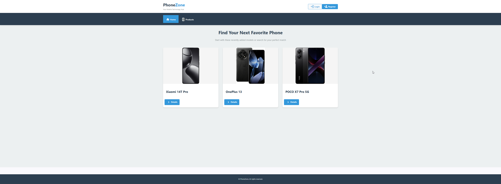
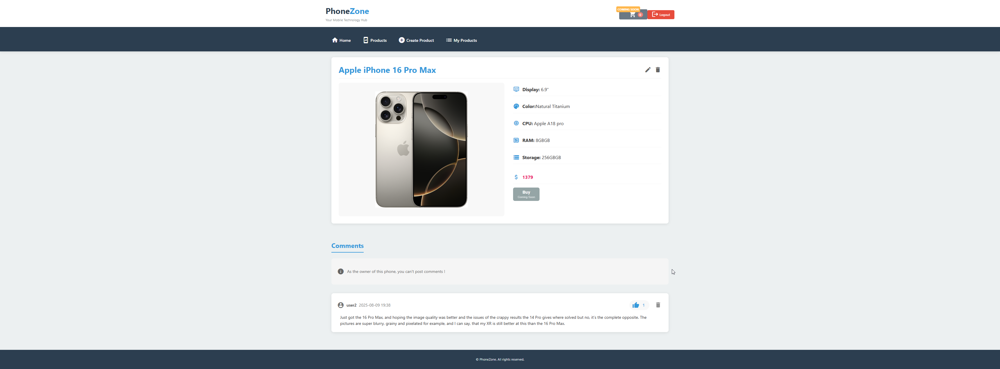

<div align="center" style="display: flex; flex-direction: column; align-items: center; gap: 8px; margin-bottom: 30px;">
  
</div>
 
<p align="center">
  <a href="https://github.com/KNedov/Angular-Project/blob/main/LICENSE">
    
  </a>
</p>

---

## 📌 Project Description

**PhoneZone** is a web application for managing, posting, and browsing phone listings.  
The project includes an **Angular front-end** and **Node.js/Express back-end**, with a **MongoDB** database.  
Authentication is implemented via **JWT (JSON Web Tokens)**, and the app is deployed on **Render**.

🔗 **Deployed version:** [PhoneZone](https://phonezone.onrender.com/home)  
💻 **GitHub repo:** [Angular-Project](https://github.com/KNedov/Angular-Project)

---

## 🔑 Test Users

For convenience during testing, the deployed version includes the following test accounts:

| Email           | Password |
| --------------- | -------- |
| user1@gmail.com | 12345    |
| user2@gmail.com | 12345    |
| user3@gmail.com | 12345    |

You can log in with any of these accounts to test the app’s features.

---

## 🛠️ Technologies Used

| Front-end                                                                                                                          | Back-end                                                                                          | Database                                                                                                                             | Authentication                                                                           | Deployment                                                                                                                           |
| ---------------------------------------------------------------------------------------------------------------------------------- | ------------------------------------------------------------------------------------------------- | ------------------------------------------------------------------------------------------------------------------------------------ | ---------------------------------------------------------------------------------------- | ------------------------------------------------------------------------------------------------------------------------------------ |
|  Angular (TypeScript, HTML, SCSS) |  Node.js, Express |  MongoDB (Mongoose) |  JSON Web Tokens (JWT) |  Render |

---

## 📂 Project Structure

```
/Angular-Project
│
├── phone-zone/ # Angular front-end
│ ├── src/
│ ├── angular.json
│ └── package.json
│
└── rest-api/ # Node.js/Express back-end
├── models/
├── routes/
├── server.js
└── package.json
```

---

📜 Features  
🔐 Registration and login with JWT tokens

📱 Adding new phone listings

📋 Browsing the list of phone ads

🔍 Detailed page for each phone

✏ Editing a posted ad (only by the owner)

❌ Deleting an ad (only by the owner)

💬 Adding comments to ads (only if the ad is not yours!)

🗑 Deleting comments (only your own comments)

👍 Liking comments (only if the comment is not yours)

👤 User profile with their posted ads

---

## 🚧 Future Features

-   🛒 **Shopping cart** – ability to add products for purchase
-   🗺️ **Location map** – integration with maps to show ad or store locations
-   🛍️ **Direct phone purchase** through the platform
-   🔍 **Search** – ability to search products by name

---

> ⚠️ **Note:** Some features like the shopping cart and direct purchase are still under development and currently not available in the live version. Buttons labeled "coming soon" indicate these upcoming functionalities.

> 🤖 **Additional info:** “The HTML and CSS code for this project was generated with the help of an AI assistant.”

---

## ⚙️ Additional Technical Details

-   **Route Guards**  
    Implemented to protect specific routes and ensure that only authorized users can access certain pages.

-   **HTTP Interceptors**  
    Used for centralized error handling and consistent display of error messages to the user throughout the app.  
    Additionally, an interceptor automatically sets authorization headers on outgoing requests to the server.

-   **Active Navigation Directive**  
    A custom directive that sets an active CSS class on the current navigation item, improving user experience by clearly indicating the current page.

-   **Environments**  
    Separate environment configurations for development and production are set up to manage API URLs and other environment-specific settings efficiently.

---

## 🤝 Contributing

Contributions are welcome! Please open an issue or submit a pull request.

---

## 🚀 Installation and Running

### 1️⃣ Clone the project

```bash
git clone https://github.com/KNedov/Angular-Project.git
```

### 2️⃣ Install front-end (phone-zone)

```bash
cd phone-zone
npm install
ng serve
```

By default it runs at `http://localhost:4200`

### 3️⃣ Install back-end (rest-api)

```bash
cd rest-api
npm install
node server.js
```

By default it runs at `http://localhost:3000`

---

<div align="center" style="max-width: 1920px; margin: auto;">

  <h2 style="text-transform: uppercase; font-weight: bold; margin-bottom: 10px;">Home Page</h2>
  

  <h2 style="text-transform: uppercase; font-weight: bold; margin-bottom: 10px;">Details Page</h2>
  

## </div>

## 📄 License

This project is licensed under the [MIT License](./LICENSE).  
You are free to use, copy, and modify it according to the license terms.

---

## 📬 Contact

If you have any questions or feedback, feel free to reach out to me at [k.medov.90@gmail.com](mailto:k.medov.90@gmail.com).

---

## 👨‍💻 Author

-   **Krasimir Nedov**
